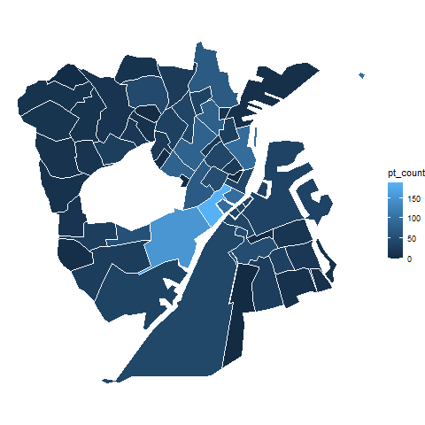

<!-- README.md is generated from README.Rmd. Please edit that file -->

```{r, echo = FALSE}
knitr::opts_chunk$set(
  collapse = TRUE,
  comment = "#>",
  fig.path = "man/figures/README-"
)
```

# dagir - Danmarks Administrative Geografiske Inddeling i R

[](https://cran.r-project.org/package=dagirlite)

Hovedfunktionen for dagir er at stille tilgængeligt komprimerede geospatielle datasæt fra DAGI som er sammenkoblet med data fra Danmarks Statistik. Dette er for de 9 områder som er tilgængeligt gennem DAGI's API fra [DAWA - Danmarks Adressers Web API](https://dawadocs.dataforsyningen.dk/).

Data er gemt som SF (Simplyfied Features) filer og nemt at arbejde med i R. Der er for inddelingerne region, kommue og sogne tilføjet data om populationen, køn og alder. Dette data kommer fra FOLK1A og SOGNE1 serierne. Denne type data er dog ikke tilgængelig for de andre inddelinger.

## Slides 2025

[UseR præsentation af dagir](https://html-preview.github.io/?url=https://github.com/LarsHernandez/dagir/blob/main/geo_useR_slides_2025_01_22/pres_useR.html#/title-slide)

## Installation

dagir er tilgængelig gennem CRAN hvor pakken hedder dagirlite. Dette grundet et 5mb loft over pakkestørrelser gør at ikke alle kort er inkluderet her. Den fulde pakke kan kan installeres fra github med følgende kode: 

```{r, eval = FALSE}
devtools::install_github("LarsHernandez/dagir")
```

# Data


```{r echo=FALSE, fig.height=8.8, fig.width=10, message=FALSE, warning=FALSE}
library(tidyverse)
library(patchwork)
library(dagir)

data(geo_sogne)
data(geo_regioner)
data(geo_kommuner)
data(geo_postnumre)
data(geo_opstillingskredse)
data(geo_afstemningsomraader)
data(geo_landsdele)
data(geo_politikredse)    
data(geo_retskredse)

p1 <- ggplot() +
  geom_sf(data = geo_regioner, color = "white", fill = "grey30", size = 0.05) + 
  theme_void() + labs(title = "Regioner (N=5)")
p2 <- ggplot() +
  geom_sf(data = geo_kommuner, color = "white", fill = "grey30", size = 0.05) + 
  theme_void() + labs(title = "Kommuner (N=99)")
p3 <- ggplot() +
  geom_sf(data = geo_sogne, color = "white", fill = "grey30", size = 0.05) + 
  theme_void() + labs(title = "Sogne (N=2141)")
p5 <- ggplot() +
  geom_sf(data = geo_landsdele, color = "white", fill = "grey30", size = 0.05) + 
  theme_void() + labs(title = "Landsdele (N=11)")
p4 <- ggplot() +
  geom_sf(data = geo_postnumre, color = "white", fill = "grey30", size = 0.05) + 
  theme_void() + labs(title = "Postnumre (N=1069)")
p6 <- ggplot() +
  geom_sf(data = geo_opstillingskredse, color = "white", fill = "grey30", size = 0.05) + 
  theme_void() + labs(title = "Opstillingskredse 1km (N=92)")
p7 <- ggplot() +
  geom_sf(data = geo_afstemningsomraader, color = "white", fill = "grey30", size = 0.05) + 
  theme_void() + labs(title = "Afstemningsomraader (N=1383)")
p8 <- ggplot() +
  geom_sf(data = geo_politikredse, color = "white", fill = "grey30", size = 0.05) + 
  theme_void() + labs(title = "Politikredse (N=12)")
p9 <- ggplot() +
  geom_sf(data = geo_retskredse, color = "white", fill = "grey30", size = 0.05) + 
  theme_void() + labs(title = "Retskredse (N=24)")

p1 + p2 + p3 + p5 + p6 + p7 + p8 + p9 +p4
```


## Data format

```{r message=FALSE, warning=FALSE}
library(tidyverse)
library(dagir)
```

Data kan loades med `data()` argumentet og plottes i ggplot med `geom_sf()`.

```{r echo=TRUE}
data(geo_kommuner)

ggplot() +
  geom_sf(data = geo_kommuner, color = "white", fill = "grey30", size = 0.05) + 
  theme_void()
```

Der er tilføjet ekstra data til nogle sæt som gør det let at udregne tal justeret for befolkningen (antal, alder, køn), f.eks. incidens.

```{r echo=TRUE}
ggplot() +
  geom_sf(data = geo_kommuner, color = "white", aes(fill=avg_age), size = 0.05) + 
  scale_fill_viridis_b("Gennemsnitsalder\npr. kommune",breaks=seq(30,70,4))+
  theme_void()
```

Det er også nemt at lave subsæt og derved fokusere på specifikke steder.

```{r}
data(geo_sogne)

geo <- subset(geo_sogne,subset = geo_sogne$area=="København Municipality")

ggplot() +
  geom_sf(data = geo, color = "white", aes(fill=avg_age), size = 0.05) + 
  scale_fill_viridis_b("Alder",breaks=seq(30,70,4))+
  labs(fill="Gennemsnitsalder\npr. sogn", title="København") +
  theme_void()

```

Det er også muligt at indstille plot-området som normalt med ggplot

```{r fig.height=6, fig.width=10}
ggplot() +
  geom_sf(data = geo_sogne, color = "white", aes(fill=population), size = 0.05) + 
  scale_fill_viridis_b("Antal\nindbyggere",breaks=seq(6000,30000,6000))+
  theme_void() + 
  coord_sf(xlim=c(12.4,12.7), ylim=c(55.62,55.73))
```

Geodata i SF formatet er smart da det er nemt at pivotere. Det gør det muligt at plotte facets i Data og er meget praktisk anvendeligt ved f.eks. tidsserier for områderne.

```{r fig.height=5, fig.width=10}
geo_long <- geo %>% pivot_longer(cols=c("men","women"),names_to = "Gender",values_to = "n")

ggplot() +
  geom_sf(data = geo_long, color = "white", aes(fill=n), size = 0.05) + 
  facet_wrap(~Gender)
```


Det er også nemt at indtegne punkter hvis koordinatdata er tilgængeligt.

```{r fig.height=8, fig.width=10}
load(url("https://github.com/sebastianbarfort/mapDK/blob/master/data/benches.rda?raw=true"))

ggplot() +
  geom_sf(data = geo, color = "white", fill="grey30", size = 0.05) + 
  geom_point(data=benches, aes(lon,lat), color="cornflowerblue", size=0.5)+
  labs(title="Bænke i København", subtitle="Mon det er muligt at tælle hvor mange bænke der er i hver sogn?") +
  theme_void() 
```

Med `sf` pakken er det muligt at tælle punkterne i hvert område.

```{r fig.height=8, fig.width=10}
library(sf)

benches_st <- st_as_sf(benches, coords = c("lon", "lat"), crs = 4326, agr = "constant")

geo$pt_count <- lengths(st_intersects(geo, benches_st))

ggplot(data = geo) +
  geom_sf(color = "white", aes(fill=pt_count), size = 0.05) + 
  #geom_point(data=benches, aes(lon,lat), color="cornflowerblue", size=0.5)+
  geom_text(aes(label=pt_count, x=visueltcenter_x, y=visueltcenter_y), color="white")+
  labs(fill="Bænke")+
  theme_void() 

```

og hvis man kan også udregne størrelsen af hvert sogn. Så kunne man f.eks. udregne antal bænke pr. km^2. Her er det gjort for Aalborg kommune

```{r fig.height=8, fig.width=10}

geo <- subset(geo_sogne,subset = geo_sogne$area=="Aalborg Municipality")

geo$area <- st_area(geo)/1000000

ggplot(data = geo) +
  geom_sf(color = "white", aes(fill=as.numeric(area)), size = 0.05) + 
  geom_text(aes(label=round(as.numeric(area),1), x=visueltcenter_x, y=visueltcenter_y), color="white", size=4)+
  labs(fill="Km\U00B2")+
  theme_void() 
```

Der er mange anvendelser af funktionerne i `sf` pakken. f.eks. 

- Tilskære postnumre kortet til kun at vise landkort med `sf::st_intersection` samt et andet kort, f.eks. regioner.
- Placere centroiden fra et kort i områder fra et andet. f.eks. omregne data fra et type kort til et andet.
- andet

Brugen af `ggplot` gør det også meget fleksibelt hvis man ønsker at animere sit kort. Det kan f.eks. gøres med `gganimate` som kan lave en gif. Det kan bruges til at illustrere ændringer i punkter, f.eks. strømninger, men også bare at sample placeringer uden noget større formål som her.


```{r eval=FALSE, include=TRUE}
library(gganimate)

geo2 <- rbind(geo %>% mutate(ss = 1),
              geo %>% mutate(ss = 2, geometry = sample(geometry)))

p <- geo2 %>% 
  ggplot() +
  geom_sf(color = "white", aes(fill=pt_count), size = 0.6, show.legend = F) + 
  theme_void() +
  transition_time(ss) +
  ease_aes('linear')

map_ani <- animate(p, nframes=200, fps=40, height = 8, width = 10, units = "in",res=150)

anim_save("map_ani.gif", map_ani)
```





Der er et visuelt center for hver område (det brugte jeg før til at sætte antal på kortet). Disse punkter kan også bruges til at sætte en label på området, eller f.eks. lave en udjævning over små områder (LOESS med population som vægt).

```{r}
data(geo_regioner)

ggplot(data = geo_regioner) +
  geom_sf(color = "white", fill="grey30", size = 0.05) + 
  geom_label(aes(label=navn, x=visueltcenter_x, y=visueltcenter_y))+
  theme_void() 
```


I Danmark havde vi en kommunalreform i 2007 hvor vi gik fra 271 kommuner til 99. Mange kommuner blev sammenlagt, men nogle få fik ændret kommunegrænser og blev altså delt. Registreringer af gamle kommuner forekommer ofte i kliniske databaser eller ældre datasæt. Her er det praktisk at kunne omregne fra gamle kommuner til nye. Der ligger et datasæt som hedder ... og heri findes en nøgle som nogenlunde fordeler de gamle kommuner (med deres koder) på nye. Der er også inkluderet et ekstra sæt ældre koordinater som ikke er fra DAGI hvormed man kan plotte de gamle komuner.

```{r}
data(geo_f07)

ggplot(data = geo_f07) +
  geom_sf(color = "grey30", fill="white", size = 0.05) + 
  theme_void() 
```


# Tilgængelige datasæt

```{r}
# DAGI
data(geo_sogne)
data(geo_regioner)
data(geo_kommuner)
data(geo_postnumre)
data(geo_opstillingskredse)
data(geo_afstemningsomraader)
data(geo_landsdele)
data(geo_politikredse)    
data(geo_retskredse)

# Ikke DAGI
data(geo_f07)
```


## References

Indeholder data fra Styrelsen for Dataforsyning og Effektivisering, DAGI, september 2021

Indeholder data med egne beregninger baseret på tal fra Danmarks Statistik, september 2021

https://statistikbanken.dk/sogn1

https://statistikbanken.dk/folk1a
