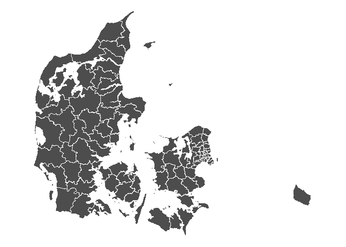

<!-- README.md is generated from README.Rmd. Please edit that file -->

# DAGIr - Danmarks Administrative Geografiske Inddeling i R

[](https://cran.r-project.org/package=ccostr)

is an R package to

data on population age and gender has been added to the datasets of
regioner, kommuner and sogne

## Installation

may be installed using the following command

``` r
devtools::install_github("HaemAalborg/ccostr")
# Or including a vignette that demonstrates the bias and coverage of the estimators
devtools::install_github("HaemAalborg/ccostr", build = TRUE, build_opts = c("--no-resave-data", "--no-manual"))
```

# Overview

The main function of

## Data format

``` r
library(DAGI)
library(knitr)
library(tidyverse)
library(patchwork)
```

``` r
data(geo_kommuner)

ggplot() +
  geom_sf(data = geo_kommuner, color = "white", fill = "grey30", size = 0.05) + 
  theme_void()
```

<!-- -->

``` r
data(geo_kommuner)

ggplot() +
  geom_sf(data = geo_kommuner, color = "white", aes(fill=avg_age), size = 0.05) + 
  scale_fill_viridis_c()+
  labs(title="Gennemsnitsalder pr. kommune") +
  theme_void()
```

<!-- -->

<!-- -->

## References
