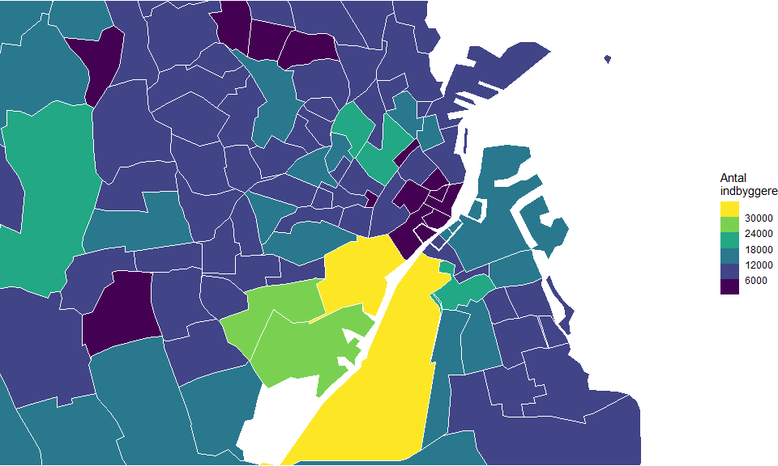
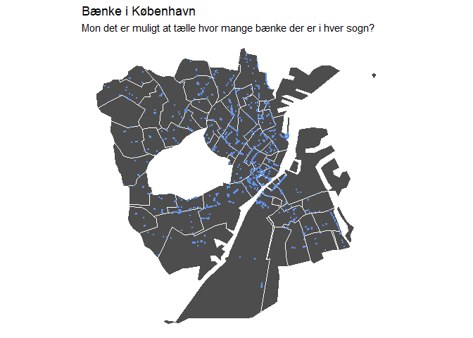

<!-- README.md is generated from README.Rmd. Please edit that file -->

# dagir - Danmarks Administrative Geografiske Inddeling i R

[](https://cran.r-project.org/package=dagir)

Hovedfunktionen for dagir er at stille tilgængeligt komprimerede
geospatielle datasæt fra DAGI som er sammenkoblet med data fra Danmarks
Statistik. Dette er for de 9 områder som er tilgængeligt gennem DAGI’s
API fra [DAWA - Danmarks Adressers Web
API](https://dawadocs.dataforsyningen.dk/).

Data er gemt som SF (Simplyfied Features) filer og nemt at arbejde med i
R. Der er for inddelingerne region, kommue og sogne tilføjet data om
populationen, køn og alder. Dette data kommer fra FOLK1A og SOGNE1
serierne. Denne type data er dog ikke tilgængelig for de andre
inddelinger.

## Installation

dagir kan installeres gennem github

``` r
devtools::install_github("LarsHernandez/dagir")
```

# Data

<!-- -->

## Data format

``` r
library(tidyverse)
library(dagir)
```

Data kan loades med `data()` argumentet og plottes i ggplot med
`geom_sf()`.

``` r
data(geo_kommuner)

ggplot() +
  geom_sf(data = geo_kommuner, color = "white", fill = "grey30", size = 0.05) + 
  theme_void()
```

<!-- -->

Der er tilføjet ekstra data til nogle sæt som gør det let at udregne tal
justeret for befolkningen (antal, alder, køn), f.eks. incidens.

``` r
ggplot() +
  geom_sf(data = geo_kommuner, color = "white", aes(fill=avg_age), size = 0.05) + 
  scale_fill_viridis_b("Gennemsnitsalder\npr. kommune",breaks=seq(30,70,4))+
  theme_void()
```

<!-- -->

Det er også nemt at lave subsæt og derved fokusere på specifikke steder.

``` r
data(geo_sogne)

geo <- subset(geo_sogne,subset = geo_sogne$area=="København Municipality")

ggplot() +
  geom_sf(data = geo, color = "white", aes(fill=avg_age), size = 0.05) + 
  scale_fill_viridis_b("Alder",breaks=seq(30,70,4))+
  labs(fill="Gennemsnitsalder\npr. sogn", title="København") +
  theme_void()
```

<!-- -->

Det er også muligt at indstille plot-området som normalt med ggplot

``` r
ggplot() +
  geom_sf(data = geo_sogne, color = "white", aes(fill=population), size = 0.05) + 
  scale_fill_viridis_b("Antal\nindbyggere",breaks=seq(6000,30000,6000))+
  theme_void() + 
  coord_sf(xlim=c(12.4,12.7), ylim=c(55.62,55.73))
```

<!-- -->

Geodata i SF formatet er smart da det er nemt at pivotere. Det gør det
muligt at plotte facets i Data og er meget praktisk anvendeligt ved
f.eks. tidsserier for områderne.

``` r
geo_long <- geo %>% pivot_longer(cols=c("men","women"),names_to = "Gender",values_to = "n")

ggplot() +
  geom_sf(data = geo_long, color = "white", aes(fill=n), size = 0.05) + 
  facet_wrap(~Gender)
```

<!-- -->

Det er også nemt at indtegne punkter hvis koordinatdata er tilgængeligt.

``` r
load(url("https://github.com/sebastianbarfort/mapDK/blob/master/data/benches.rda?raw=true"))

ggplot() +
  geom_sf(data = geo, color = "white", fill="grey30", size = 0.05) + 
  geom_point(data=benches, aes(lon,lat), color="cornflowerblue", size=0.5)+
  labs(title="Bænke i København", subtitle="Mon det er muligt at tælle hvor mange bænke der er i hver sogn?") +
  theme_void() 
```

<!-- -->

Med `sf` pakken er det muligt at tælle punkterne i hvert område.

``` r
library(sf)
#> Linking to GEOS 3.9.0, GDAL 3.2.1, PROJ 7.2.1

benches_st <- st_as_sf(benches, coords = c("lon", "lat"), crs = 4326, agr = "constant")

geo$pt_count <- lengths(st_intersects(geo, benches_st))

ggplot(data = geo) +
  geom_sf(color = "white", aes(fill=pt_count), size = 0.05) + 
  geom_point(data=benches, aes(lon,lat), color="cornflowerblue", size=0.5)+
  geom_text(aes(label=pt_count, x=visueltcenter_x, y=visueltcenter_y), color="white")+
  labs(fill="Bænke")+
  theme_void() 
```

<!-- -->

Der er et visuelt center for hver område (det brugte jeg før til at
sætte antal på kortet). Disse punkter kan også bruges til at sætte en
label på området, eller f.eks. lave en udjævning over små områder (LOESS
med population som vægt)

``` r
data(geo_regioner)

ggplot(data = geo_regioner) +
  geom_sf(color = "white", fill="grey30", size = 0.05) + 
  geom_label(aes(label=navn, x=visueltcenter_x, y=visueltcenter_y))+
  theme_void() 
```

<!-- -->

# Tilgængelige datasæt

``` r
data(geo_sogne)
data(geo_regioner)
data(geo_kommuner)
data(geo_postnumre)
data(geo_opstillingskredse)
data(geo_afstemningsomraader)
data(geo_landsdele)
data(geo_politikredse)    
data(geo_retskredse)
```

## References
